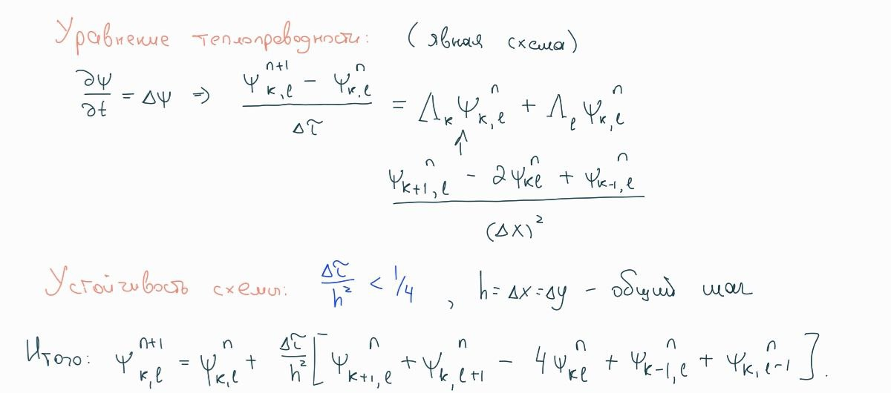

# Compiler project

This project was created to practice my compiler knowledge

### Requirements

SFML must be downloaded.

### Build broject

Just an ordinary cmake building

```mkdir build && cd build && cmake ../ && cmake --build .```

To build using my LLVM-generator

``` make compile-llvm ```

Yes, it's the worst makefile that you have ever seen :)

### Explanation



### Language

