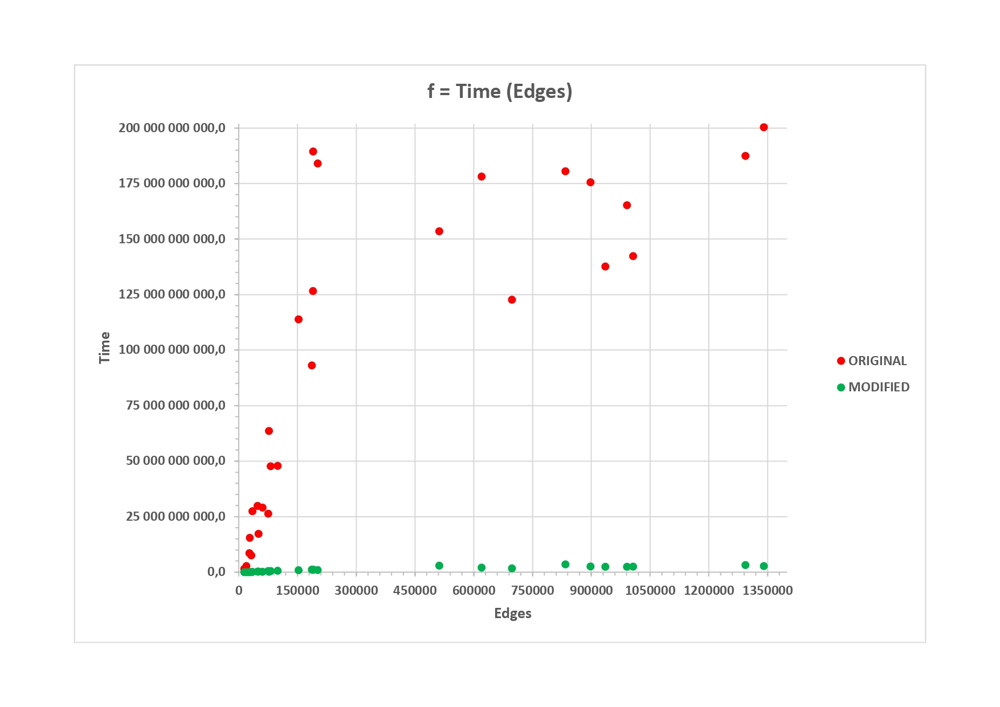
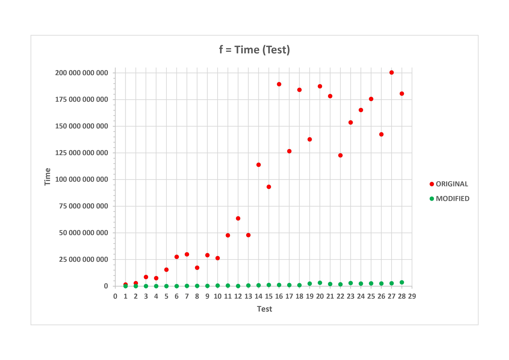
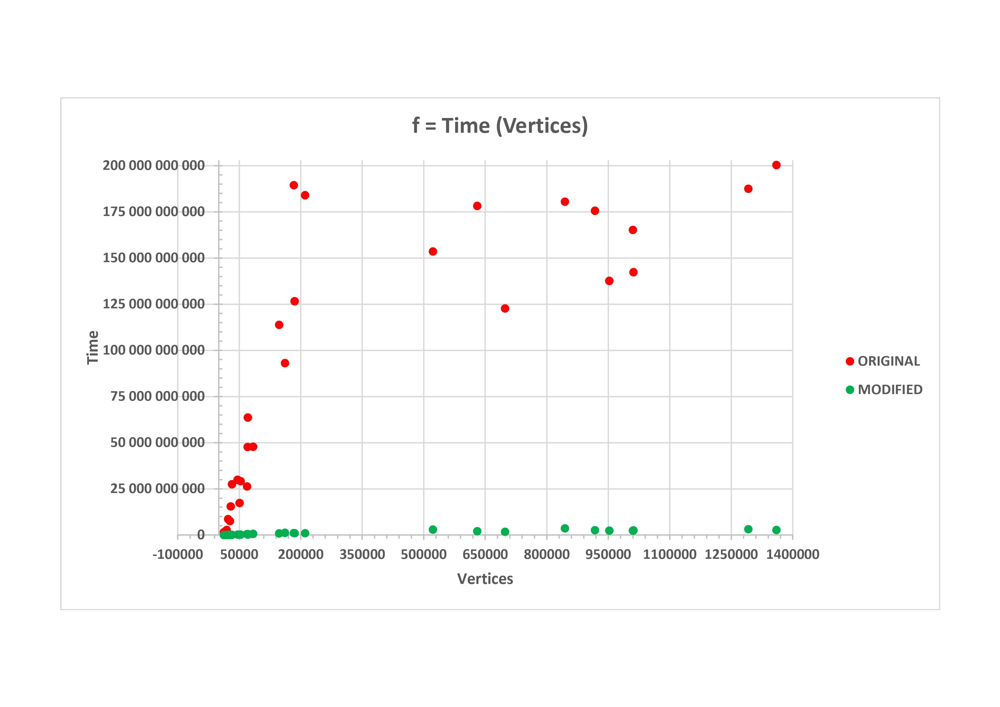
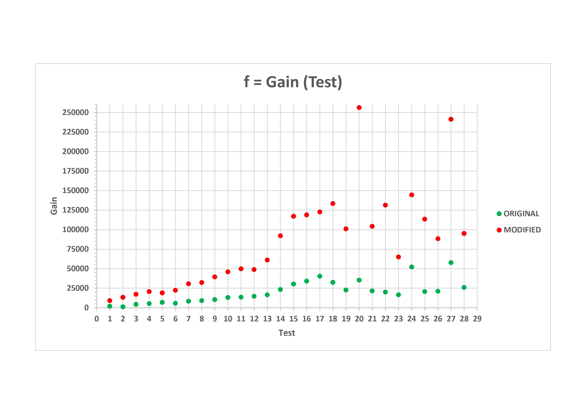

# Fiduccia-Mattheyses algorithm

### Собрать проект

```
git clone https://github.com/MarkGoncharovAl/4th_grade
cd 4th_grade/Fiduccia
cmake -S . -B build
cmake --build build
```

### Использование

> Windows
```
.\bin\Fiduccia.exe <absolute path to bench>
.\bin\FiducciaMod.exe <absolute path to bench>
```
> Linux
```
./bin/Fiduccia <absolute path to bench>
./bin/FiducciaMod <absolute path to bench>
```

### Цель проекта

Для данной сети, состоящей из набора ячеек соединённых набором соединений, найти разделение на 2 части так, чтобы число связей, которые соединяют ячейки в обоих блоках было минимально.

### Краткое описание алгоритма
1. Берём разрез ячеек. 
2. Переместить ячейку за раз из одного блока в другой, чтобы минимизировать разрез. 
3. Gain ячейки = число связей, которые содержат ячейку, если она единственная в блоке, минус число связей, которые содержат ячейку, если она полностью лежит в одном блоке. 
4. Выбираем ячейку для перемещения с большим Gain. 
5. Выбираем критерием балансировки, чтобы не допустить перемещение всех ячеек в одну сторону. 
6. Полученный результат используем как входной разрез в следующую итерации
7. Повторяем до тех пор, пока алгоритм не перестанет давать улучшение.

### Краткое описание имплементации
1. Граф = вектор. Да, не лист, слишком долго иначе работает.
2. Разрез = вектор флагов, справа или слева располагается каждая ячейка. 
3. Gain контейнер = отсортированный по Gain'у набор ячеек

### Моя модификация алгоритма
1. Отслеживание ячеек, которые заблокированы можно сделать через флаги
2. Для каждой ячейки отслеживается вклад в стоимость.
3. Обработка ячеек = итерирование по массиву, а сама ячейка - константа.

### Результат 
1. Реализовали алгоритм Фидучча-Матейсис
2. Основное преимущество от внедрения модифицированного алгоритма - повышение производительности.

### Приложение




