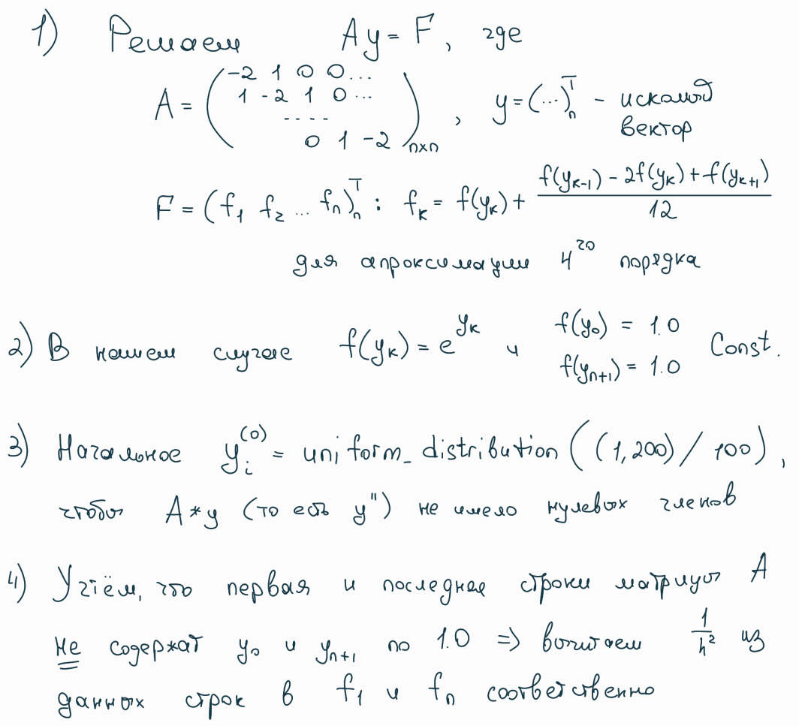
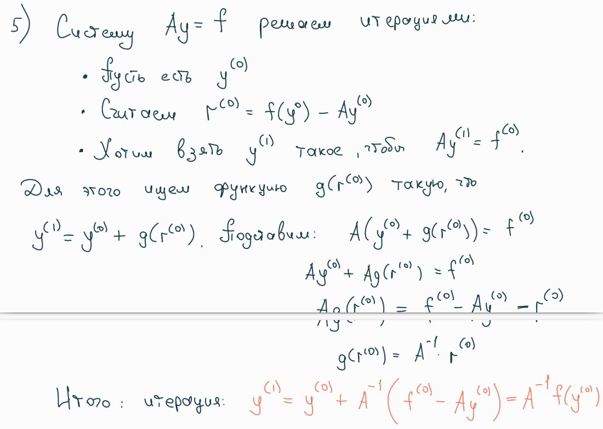
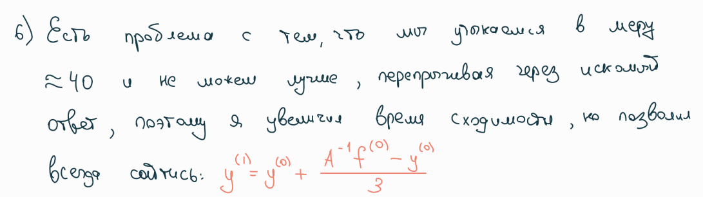

# Параллельное решение диференциального уравнения

[Условие задачи](%D0%A3%D1%81%D0%BB%D0%BE%D0%B2%D0%B8%D1%8F.pdf)

## Метод решения уравнения







## Структура решения

```
main.cpp(замеры времени) = math.cpp(реализации функций) + common.hpp(определение)
```

## Метод распараллеливания.

Основная нагрузка идёт на вычисления векторных операций. 

```cpp
  vector Mult (const matrix& lhs , const vector& rhs)
  {
    vector out (size);
    for (int i = 0; i < size; ++i)
    {
      out[i] = 0;
      for (int j = 0; j < size; ++j)
        out[i] += lhs[i][j] * rhs[j];
    }
    return out;
  }
```

Делится на восемь блоков и параллелится с помощью технологии OpenMP

```cpp
  vector Mult (const matrix& lhs , const vector& rhs)
  {
    vector out (size);
    
    #pragma parallel for num_thread(8)
    for (int k = 0; k < 8; ++k)
    {
      int offset = k * size / 8;
      for (int i = offset; i < offset + size / 8; ++i)
      {
        out[i] = 0;
        for (int j = 0; j < size; ++j)
          out[i] += lhs[i][j] * rhs[j];
      }
    }
    return out;
  }
```

Аналогичные действия применяем для векторных сложения, умножения и деления на целое число.

Достигаем ускорения в 9%, что, увы, медленно, но успешно

## Дополнительно

Проанализировал методы распараллеливания алгоритмов стандартной библиотеки.

В процессе измерения нормы L2, а точнее её квадрата

```cpp
std::transform_reduce (data.cbegin () , data.cend () , 0.0 , std::plus {} , [](const double elem) { return elem * elem; });
```

При использовании execution_policy (таких как execution::par и par_unseq) мы почти не наблюдаем ускорения.
Это связано с тем, что основная нагрузка на std::plus{}, который не может быть вычислен самостоятельно, без
зависимостей от transform, который в данном случае довольно простой. Поэтому данный метод применим для более
тяжеловесных transform операций.